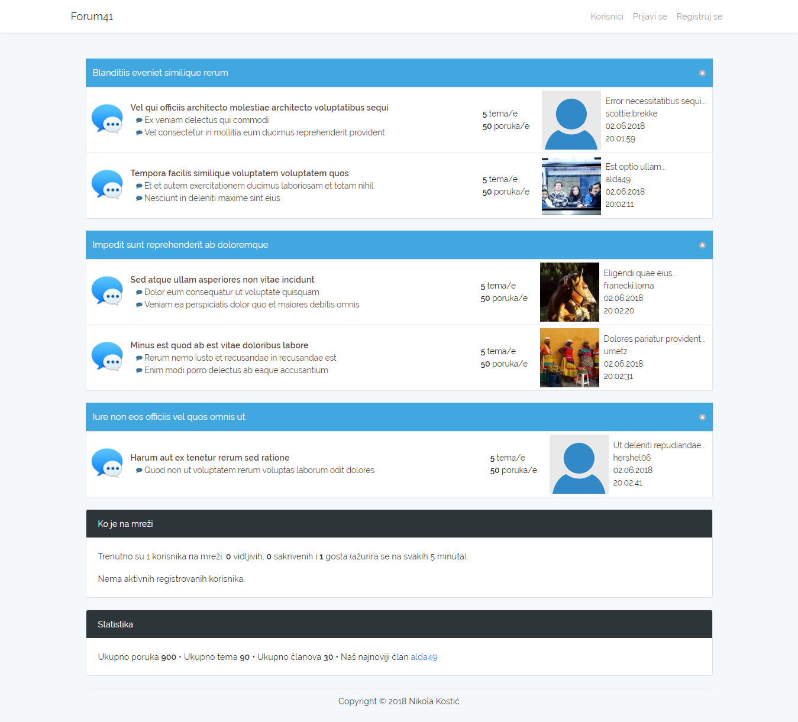
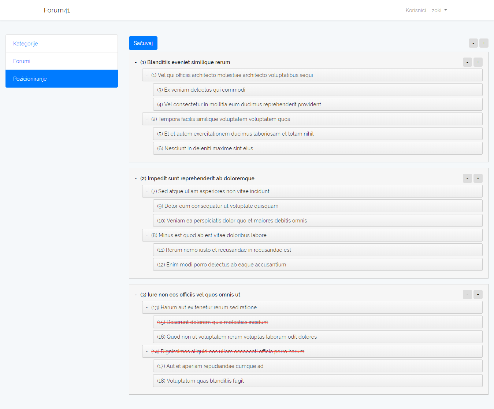
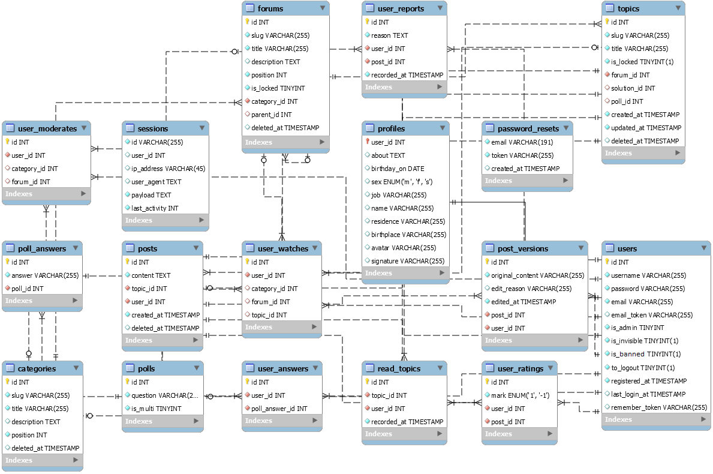

# SimpleForumSoftware

Projekat iz Web programiranja. Prva Laravel aplikacija. Bez nekih originalnih ideja.

|  |  |
|:---:|:---:|
| Public Area | Admin Area |

## Projekat završen

Implementirao sam najosnovnije funkcionalnosti forum softvera i pritom ispunio sve uslove projekta.

### Šta je odrađeno

* Puno toga

### Šta je još bilo planirano

* Glasanje ★
* Ćaskanje
* Moderatori ★
* Višejezičnost ★
* Privatne poruke
* Izbor šeme boja
* Ko je gledao profil
* Prijavljivanje neprikladnih poruka ★
* Praćenje tema, poruka i kategorija ★
* Prikazuj trenutnu aktivnost korisnika
* Registracija putem društvenih mreža
* Refaktorizacija
  * Trenutno je sve zbrda-zdola sklopljeno kako bi projekat što pre bio završen.
* Praćenje IP adresa korisnika
  * Da se osiguramo da korisnik nema više od jednog naloga.
* Moj, centralizovan, hosting
  -  Kao što nudi [Forumotion](https://www.forumotion.com/). Trenutno aplikaciju svako mora da skine i instalira na svom serveru. 
* Izmena poruka ★
  * Verzije poruka se čuvaju u posebnoj tabeli. Admini imaju opciju da urade undo (posle ne može redo).
* Lajkovanje/dislajkovanje poruka ★
  * Poruke sa negativnim rejtingom se sakrivaju (korisnik može da prikaže poruku ako želi). Korisnici koji daju loše rejtinge jer nemaju pametnija posla gube mogućnost da ostavljaju rejting. Admin može da poništi rejting ako proceni da nije validan.

★ Sve je pripremljeno (npr. u bazi), ali ipak nije implementirano.

## Instalacija

TODO

## Vendor

* [fzaninotto](https://github.com/fzaninotto)/**[Faker](https://github.com/fzaninotto/Faker)**
* [letrunghieu](https://github.com/letrunghieu)/**[active](https://github.com/letrunghieu/active)**
* [CodeSeven](https://github.com/CodeSeven)/**[toastr](https://github.com/CodeSeven/toastr)**
* [dbushell](https://github.com/dbushell)/**[Nestable](https://github.com/dbushell/Nestable)**
* [samclarke](https://github.com/samclarke)/**[SCEditor](https://github.com/samclarke/SCEditor)**
* [chriskonnertz](https://github.com/chriskonnertz)/**[bbcode](https://github.com/chriskonnertz/bbcode)**
* [davatron5000](https://github.com/davatron5000)/**[FitText.js](https://github.com/davatron5000/FitText.js)**
* [barryvdh](https://github.com/barryvdh)/**[laravel-debugbar](https://github.com/barryvdh/laravel-debugbar)**
* [thomastkim](https://github.com/thomastkim)/**[laravel-online-users](https://github.com/thomastkim/laravel-online-users)**
* [Jimmy-JS](https://github.com/Jimmy-JS)/**[laravel-report-generator](https://github.com/Jimmy-JS/laravel-report-generator)**

## Baza podataka

