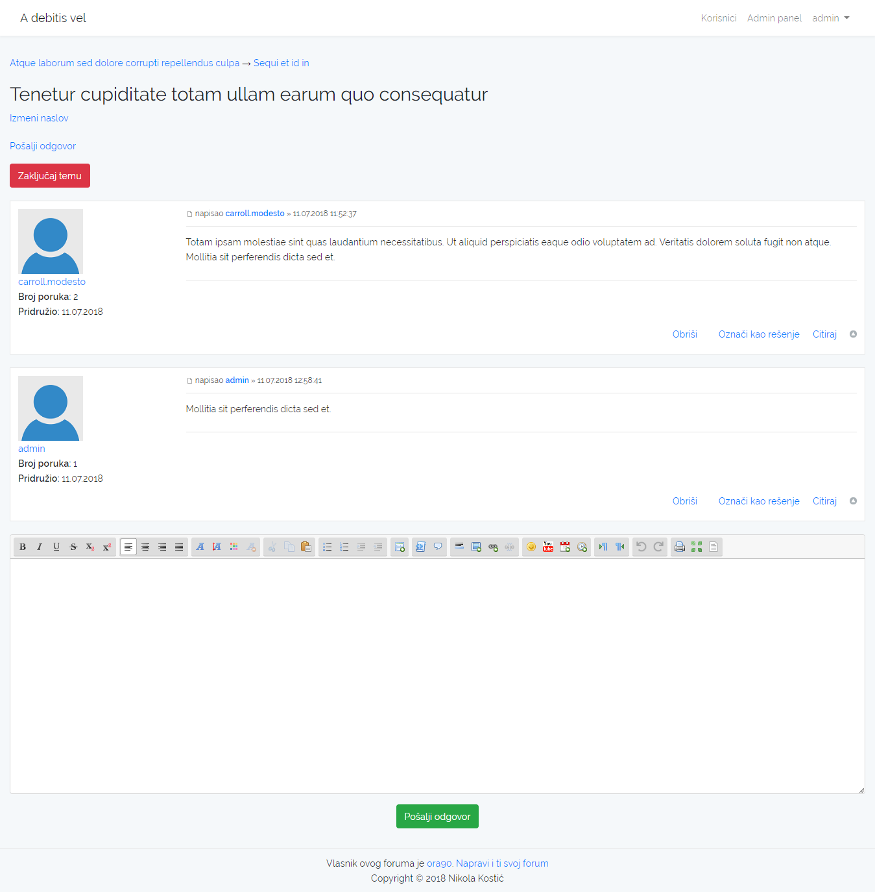
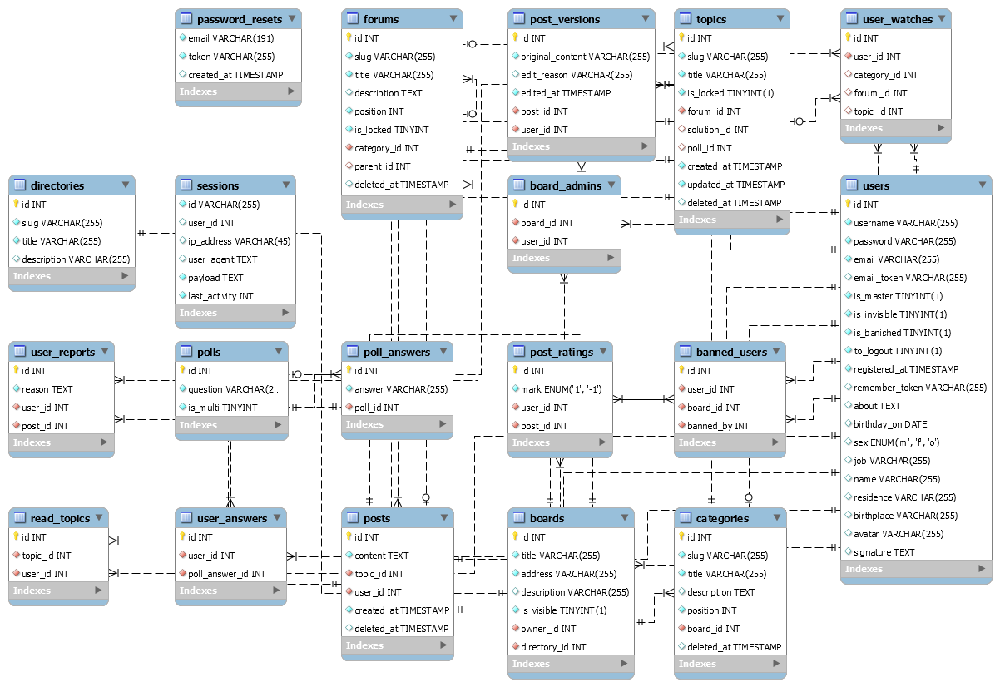

# Cilj projekta

Omogućiti svakom ko to želi da prostim klikom na dugme napravi svoj forum.


# Instalacija

```bash
$ git clone https://github.com/nkostic97vr/pmf-web-forum.git
$ cd pmf-web-forum
$ composer install
$ npm install
$ npm run dev
$ mv .env.example .env
$ php artisan key:generate
```
Podesiti sve kako treba u `.env` fajlu.
```bash
$ php artisan migrate --seed
```

## Windows Localhost

Apache, PHP i MySQL paket za Windows OS koji preferiram je [Laragon Wamp](https://laragon.org/). Smeštanjem projektnog direktorijuma u *laragon/www* direktorijum se automatski generiše virtuelni host, kao i hosts mapiranje.

Međutim, za identifikaciju različitih foruma na mreži se koriste poddomeni.

```bash
http://<adresa-foruma>.<APP_DOMAIN>/ # http://matematika.pmf-web-forum.test/
```

---

*Kako bi olakšao instalaciju i testiranje, po defaultu će se ipak koristiti poddirektorijumi (`http://pmf-web-forum.test/boards/matematika`).*

*Ako želite da koristite poddomene:*
```
mv routes/web.php routes/web.subdirectories.php
mv routes/web.subdomains.php routes/web.php
```

---

Potrebno je dodati hosts mapiranja i za njih. Nemoguće je jednostavno izlistati sve poddomene jer su dinamički, a pride Windows hosts fajl ne podržava wildcard znakove.

Program [Acrylic DNS Proxy](https://mayakron.altervista.org/) dolazi uz svoj hosts fajl koji podržava wildcard znakove i regularne izraze. Da bi radio kako treba, potrebno je podesiti Preffered DNS Server aktivnog mrežnog adaptera na `127.0.0.1`.

 * [Windows 7](https://mayakron.altervista.org/wikibase/show.php?id=AcrylicWindows7Configuration)
 * [Windows 8](https://mayakron.altervista.org/wikibase/show.php?id=AcrylicWindows8Configuration)
 * [Windows 10](https://mayakron.altervista.org/wikibase/show.php?id=AcrylicWindows10Configuration)

Adapter na kome ste konfigurisali DNS mora biti aktivan; npr. ako ste konfigurisali WiFi adapter, morate biti povezani na neku WiFi mrežu, čak i ako ona ne funkcioniše. Ovde predlažem instalaciju i korišćenje virtuelnog mrežnog interfejsa poput [Microsoft Loopback Adapter](https://kb.vmware.com/s/article/1004779).

U direktorijumu gde ste instalirali Acrylic DNS Proxy pronađite *AcrylicHosts.txt* i dodajte odgovarajuće mapiranje.

```
127.0.0.1    >pmf-web-forum.test
```

Restartujte servis pokretanjem *RestartAcrylicService.bat*.

Čistač đubreta se može pokretati ručno naredbom `php artisan garbagec`, a po želji možete konfigurisati da se poziva automatski. Kada jednom bude pokrenut, izvršavaće se svakog dana u ponoć.

1. Otvorite Task Scheduler (Start meni →  `taskschd.msc`).
1. Action meni → Create Task...
1. Kartica General → upišite Name po želji.
1. Kartica Triggers → New... → Begin the task: At log on for any user → OK.
1. Kartica Actions → New... → Action: Start a program → Browse → *php-web-forum/scheduler.bat* → OK.
1. OK.
1. Task Scheduler Library → pronađite novokreirani zadatak → desni klik → Run.

# Testiranje

Bazu možete popuniti random podacima sledećom naredbom:

```bash
$ php artisan db:seed --class=RandomSeeder
```

Između ostalog, generisaće se random korisnici sa lozinkom `secret` (korisnička imena pročitajte iz tabele korisnika). Količina generisanih podataka se može konfigurisati u *database/seeds/RandomSeeder.php* fajlu. Trenutno su vrednosti stavljene skoro na minimum jer u suprotnom proces zna da traje dosta dugo.

Lažni SMTP server [MailTrap](https://mailtrap.io/) može poslužiti za testiranje mejlova.

# Više o projektu

## Organizacija

U većini aspekata je prisutan neki vid hijerarhijske organizacije.

1. Poruke su srž svakog foruma.
1. Teme se sastoje od poruka.
1. Forumi se sastoje od tema (i potforumova).
1. Kategorije se sastoje od forumova.
1. Forumi (Internet forums, message boards) se sastoje od kategorija.
1. Direktorijumi se sastoje od bordova.

---

*Na Internetu se često termin "forum" koristi da označi dva različita pojma, a iz konteksta se zaključuje o čemu se radi. U PHP kodu uvek jasno odvajam `board` i `forum`.*

---

Kod korisničih grupa veza je is-a, tj. proizvoljna korisnička grupa nasleđuje sve odlike prethodne.
1. Gosti mogu da
   * čitaju poruke koje su ostavili registrovani korisnici.
1. Obični korisnici mogu da
   * menjaju svoj profil;
   * otvaraju nove teme;
   * odgovaraju na postojeće teme:
   * menjaju naslov svojih tema;
   * pregledaju profile drugih korisnika;
   * u svojim temama proglase neku poruku za najbolji odgovor (rešenje);
   * izbrišu svoju poruku, ali samo ukoliko je to poslednja poruka u temi;
   * izbrišu svoju temu, ali samo ukoliko niko nije odgovorio na nju;
   * naprave svoj forum, čime postaju *vlasnici foruma*.
1. Obični administratori
   * Pomoćnici vlasnika foruma.
   * Uređivačke mogućnosti su ograničene na forume koje administriraju.
   * Mogu da
     * menjaju naslove tuđih tema;
     * banuju korisnike sa foruma;
     * brišu i vraćaju svoje i tuđe poruke;
     * dodeljuju i oduzimaju admin uloge od drugih korisnika;
     * proglase neki odgovor za najbolji u tuđim temama;
     * generišu izveštaje o forumu u PDF formatu;
     * menjaju strukturu foruma.
1. Vlasnici foruma
   * ne mogu biti banovani sa svojih foruma;
   * ne može im se oduzeti administratorska titula.
1. Master administratori
   * Uređivačke mogućnosti obuhvataju sve forume na mreži.
   * Mogu da
     * menjaju tuđe profile;
     * prave i menjaju direktorijume;
     * prognaju korisnike sa celokupne mreže foruma;
     * dodeljuju ili oduzimaju master admin uloge od drugih korisnika.
1. Admin/Admin master administrator
   * ne može biti prognan sa mreže foruma;
   * ne može mu se oduzeti master admin titula.
1. Osoba koja ima direktan pristup bazi
   * Nijednoj korisničkoj grupi nisam hteo da dam destruktivne mogućnosti, tj. niko ništa ne može da obriše iz baze. Nikakvo "brisanje" koje jesam implementirao ne briše ništa u stvari, već ga samo sakriva. Samo osoba sa direktnim pristupom bazi može vršiti destruktivne operacije.

---

*U toku instalacije se automatski dodaje `admin`/`admin` master administrator u bazu.*

---

## Autentikacija

Na svakoj stranici koja ima neke veze sa autentikacijom je postavljena [Invisible reCAPTCHA](https://www.google.com/recaptcha/) kako bi utvrdili da je onaj koji pristupa toj stranici zaista ljudsko biće. To je opciona funkcionalnost jer njeno aktiviranje zahteva posedovanje Google naloga, te registrovanje domena na njihovom sajtu kako bi dobili `CAPTCHA_SITE_KEY` i `CAPTCHA_SECRET_KEY`.

Da bi mogao da se prijavi na sajt, korisnik mora da potvrdi registraciju pomoću linka koji dobija na mejl adresu navedenu prilikom registracije. Korisnici koji su potvrdili svoj nalog mogu resetovati svoju lozinku u slučaju da su je zaboravili.

## Logovanje

Laravel dolazi uz kompleksan sistem za logovanje i u log fajlovima upisuje detaljne informacije o nastalim greškama. Ponekad je veoma teško snaći se u njima, tako da sam napravio veoma prostu log klasu kako bi povremeno beležio neke kratke poruke.

## Čistač đubreta

Čistač đubreta briše zastarele podatke iz baze podataka.

Da li je neka tema pročitana ili nije pročitana od strane određenog korisnika određujem na sledeći način:

1. Tema je pročitana ako je zastarela, tj. ako nije ažurirana više od `RECENT_TOPIC_DAYS` dana.
1. Korisnik koji ima ID `user_id` je pročitao temu koja ima ID `topic_id` ako u tabeli `read_topics` postoji unos (`user_id`, `topic_id`).

Jasno je da tabela `read_topics` može postati veoma glomazna ako postoji veliki broj korisnika i veliki broj tema. Zato i postoji granica od `RECENT_TOPIC_DAYS` dana, kako bi nakon isteka tog vremenskog perioda mogao koliko toliko osloboditi tabelu `read_topics` brišući redove koji se odnose na zastarele teme.

# Skrinšotovi





# Tehnologije

* [SCSS](https://sass-lang.com/)
* [jQuery](https://jquery.com/)
* [Laravel](https://laravel.com/)
* [Bootstrap](https://getbootstrap.com/)

## Paketi

* [fzaninotto](https://github.com/fzaninotto)/[Faker](https://github.com/fzaninotto/Faker)
  * generisanje random podataka
* [CodeSeven](https://github.com/CodeSeven)/[toastr](https://github.com/CodeSeven/toastr)
  * pop-up obaveštenja
* [letrunghieu](https://github.com/letrunghieu)/[active](https://github.com/letrunghieu/active)
  * lakše postavljanje `active` klase
* [dbushell](https://github.com/dbushell)/[Nestable](https://github.com/dbushell/Nestable)
  * jQuery UI dodatak
* [samclarke](https://github.com/samclarke)/[SCEditor](https://github.com/samclarke/SCEditor)
  * BBCode editor
    * Uglavnom sam ga usklađivao sa parserom jer nisu koristili identičnu BBCode sintaksu.
    * Dodao sam Undo i Redo dugmad u toolbar.
 * [chriskonnertz](https://github.com/chriskonnertz)/[bbcode](https://github.com/chriskonnertz/bbcode)
    * BBCode parser
       * Sprečio sam parsovanje BBCode tagova unutar `[code]` tagova.
       * Dodao sam neke osnovne BBCode tagove koje parser nije podržavao.
       * Ubacio sam parsovanje smajlija.
 * [davatron5000](https://github.com/davatron5000)/[FitText.js](https://github.com/davatron5000/FitText.js)
    * responzivne dimenzije teksta
 * [thomastkim](https://github.com/thomastkim)/[laravel-online-users](https://github.com/thomastkim/laravel-online-users)
    * listanje korisnika koji su na mreži
* [Jimmy-JS](https://github.com/Jimmy-JS)/[laravel-report-generator](https://github.com/Jimmy-JS/laravel-report-generator)
  * generisanje izveštaja

# Pripremane funkcionalnosti

U programskom koda ili u strukturi baze se mogu uočiti tragovi nekih funkcionalnosti koje nisam naveo ovde. Od njih se odustalo. To su:

 * glasanje,
 * višejezičnost,
 * izbor šeme boja,
 * prijavljivanje neprikladnih poruka,
 * praćenje tema, poruka i kategorija,
 * izmena poruka i
    * Sve verzije poruka se čuvaju u posebnoj tabeli. Te verzije su vidljive samo moderatorima i korisniku koji je poruku poslao. Postoji opcija da se poruka vrati u pređašnje stanje.
 * lajkovanje/dislajkovanje poruka.
    * Poruke sa negativnim rejtingom se sakrivaju (korisnik može da prikaže poruku ako želi). Korisnici koji daju loše rejtinge jer nemaju pametnija posla gube mogućnost da ostavljaju rejting. Admin može da poništi rejting ako proceni da nije validan.
